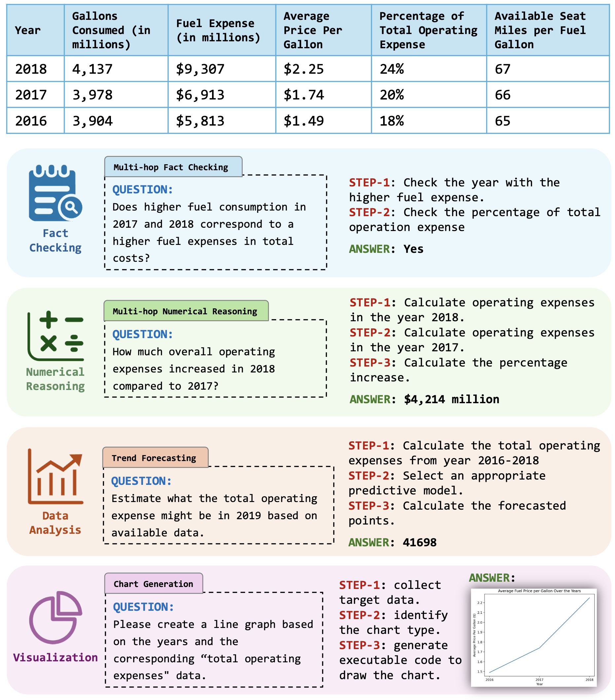
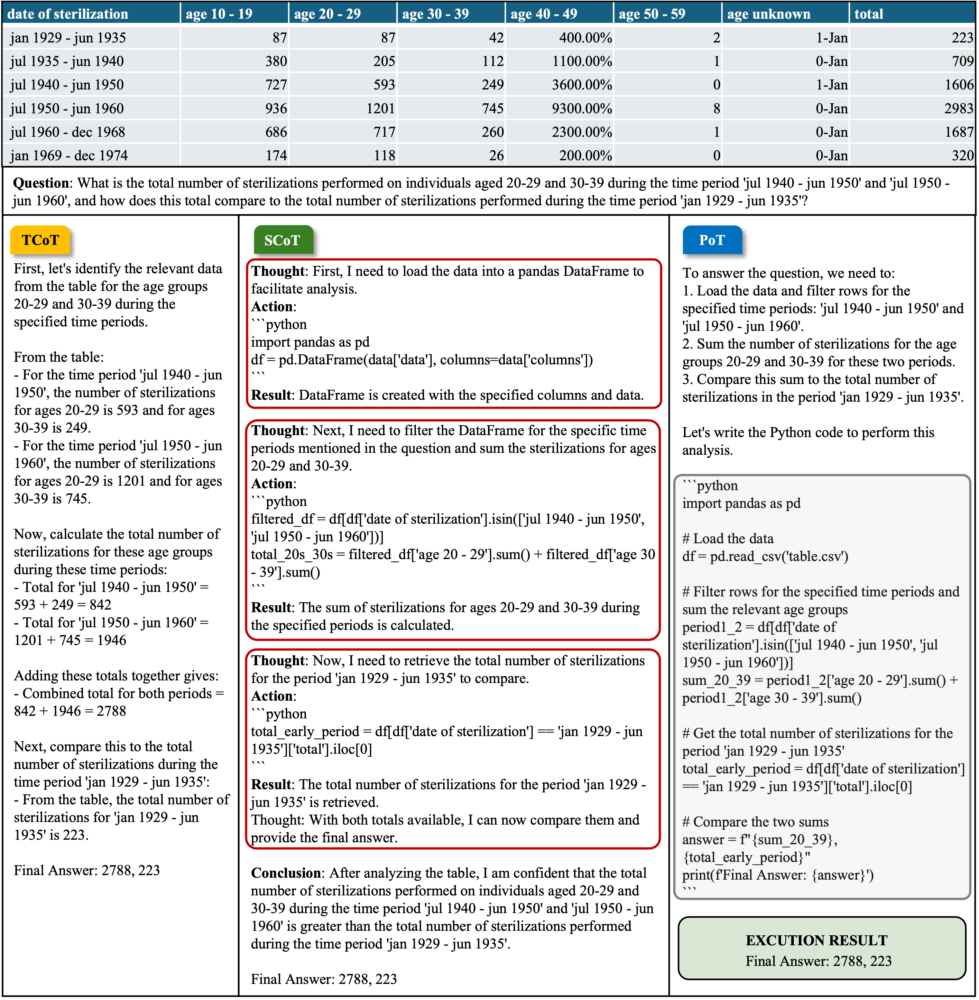

# TableBench
<div align="left" style="line-height: 1;">
  <a href="" style="margin: 2px;">
    
  </a>
  <a href="" style="margin: 2px;">
    
  </a>
</div>

Official repository for paper `TableBench: A Comprehensive and Complex Benchmark for Table Question Answering`

<p align="left">
    <a href="https://tablebench.github.io/">🏆  Leaderboard&nbsp;&nbsp;</a> 
    <a href="https://arxiv.org/abs/2408.09174">📚 Paper&nbsp;&nbsp;</a>
    <a href="https://huggingface.co/datasets/Multilingual-Multimodal-NLP/TableBench">🤗 TableBench&nbsp;&nbsp;</a> 
    <a href="https://huggingface.co/datasets/Multilingual-Multimodal-NLP/TableInstruct">🤗 TableInstruct&nbsp;&nbsp;</a> 
</p>

## News
> **🔥Apr. 18, 2025🔥** 
>
> 1. **☀️ Enhanced TableBench**:
>  We’ve released an cleaner version of TableBench, after thoroughly reviewing all test set cases and correcting any errors we identified. Please download the latest version of [TableBench](https://huggingface.co/datasets/Multilingual-Multimodal-NLP/TableBench) for the most accurate dataset.
>
> 2. **🚀 Brand New Leaderboard**:
> The brand new [Leaderboard](https://tablebench.github.io/) is now live! We’re excited to invite submissions, which will be dynamically updated in real-time. For submission guidelines, please refer to the Submission section in the leaderboard website.
>
> 3. **🔍 Refined Evaluation Metrics**:
> In response to community feedback and in-depth discussions, we've updated the evaluation metrics for Fact Checking, Numerical Reasoning, and Data Analysis. You can find the detailed specifications of these new metrics here.
>
> **🚀Jan. 21, 2025🚀**: 
> 
> We are thrilled to share that our paper has been accepted to AAAI 2025! We sincerely thank our co-authors, the anonymous reviewers, and all the researchers and users on GitHub or through email whose valuable feedback and support have greatly contributed to this work.

## 🧾 Overview
<code style="color:#8b44c7"><b>TableBench</b></code> is a <b>comprehensive</b> and <b>complex</b>
                benchmark designed to evaluate Table
                Question Answering (TableQA) capabilities, aligning closely with the "<code style="color:#8b44c7"><b>Reasoning Complexity of
                Questions</b></code>" dimension in real-world Table QA scenarios. It covers <b>18</b> question
                categories
                across <b>4</b> major ategories—including <b>Fact Checking</b>, <b>Numerical Reasoning</b>, <b>Data
                  Analysis</b>, and <b>Visualization</b>—with <b>886</b> carefully curated test cases. TableBench
                substantially pushes the boundaries of large language models in complex TableQA scenarios.
<p align="center">

</p>

## 📐 Evaluation Metrics

This module defines evaluation metrics for various sub-tasks:

### 🔍 Fact Checking
- **Metric:** Exact Match (EM)  
- **Description:** Assesses whether the predicted statement exactly matches the reference.

### 🔢 Numerical Reasoning
- **Metric:** Exact Match (EM)  
- **Description:** Focuses on the correctness of numerical outputs.

### 📈 Data Analysis
- Metrics vary based on sub-task type:

| Task Type               | Metric            | Description                                                |
|------------------------|-------------------|------------------------------------------------------------|
| Correlation Analysis   | EM_with_error_10  | Allows ±10% numerical margin of error                      |
| Trend Forecasting      | EM_with_error_10  | Allows ±10% numerical margin of error                      |
| Statistical Analysis   | EM_with_error_10  | Allows ±10% numerical margin of error                      |
| Impact Analysis        | Exact Match (EM)  | Requires precise match of influential factors              |
| Other Data Tasks       | ROUGE-L           | Suitable for open-ended, textual responses                 |

### 📊 Visualization
- **Metric:** Pass@1  
- **Description:** Measures whether the correct chart is generated on the first attempt.

---

## 🔧 How to evaluate on Tablebench

### Step 1. Download the Dataset

Download the latest version of [**TableBench**](https://huggingface.co/datasets/Multilingual-Multimodal-NLP/TableBench) from Hugging Face and place it in your working directory.

### Step 2. Run Inference with Your LLM

Use your preferred Large Language Model (LLM) to generate predictions for each test case. 

Important notes:
- Store your model's predictions in the `prediction` field
- Include your model name in the `model_name` field

Example JSON structure:
```json
[
  {
    ...
    "model_name": "your-model-name-here",
    "prediction": "Final Answer: 1062"
  },
  ...
]
```
We provide an example inference result file at: `eval_examples/inference_results/o3-mini-2025-01-31=TableBench_DP=Example.jsonl`


### Step 3. Parse Final Answers from LLM Predictions
Use our parsing script to extract final answers from your model's predictions. The script `parse_tablebench_instruction_response_script.py` includes a main method example:

```python
if __name__ == '__main__':
    # ==== Global settings ====
    PROJECT_ROOT_DIR = os.path.dirname(os.path.abspath(__file__))
    EXP_DIR = 'eval_examples'

    INFERENCE_RESULT_DIR = f'{PROJECT_ROOT_DIR}/{EXP_DIR}/inference_results'
    PARSED_RUSULT_DIR = f'{PROJECT_ROOT_DIR}/{EXP_DIR}/parsed_results'

    # ==== Load inference results ====
    for inference_result_file in iter_file_from_dir(f'{INFERENCE_RESULT_DIR}', '.jsonl'):
        print(f'Parsing {inference_result_file}')
        # === Load inference results ===
        inference_results = read_json_file(inference_result_file)
        if not isinstance(inference_results, list):
            inference_results = [inference_results]
        # === Parse inference results ===
        parsed_results = parse_inference_results(inference_results)
        # === Save parsed results ===
        write_json_to_file(
            f'{PARSED_RUSULT_DIR}/{os.path.basename(inference_result_file)}', parsed_results, is_json_line=True)
    print('Parsing completed.')
```

### Step 4. Evaluate the Results
After parsing the predictions, use our evaluation script to assess your model's performance.
A main function example is provided in `eval_tablebench_script.py`

```python
if __name__ == '__main__':

    # ==== Global settings ====
    PROJECT_ROOT_DIR = os.path.dirname(os.path.abspath(__file__))
    EXP_DIR = 'eval_examples'

    PARSED_RUSULT_DIR = f'{PROJECT_ROOT_DIR}/{EXP_DIR}/parsed_results'
    EVAL_RESULT_DIR = f'{PROJECT_ROOT_DIR}/{EXP_DIR}/evaluation_results'

    # Init metric evaluation engine
    metric_eval_engine = QAMetric()

    # Merge parsed results to one file
    overall_sim_inference_results_path = merge_parsed_results_to_one_sim_file(
        PARSED_RUSULT_DIR, EVAL_RESULT_DIR)

    # Support add multiple inference result files
    candidate_eval_file_paths = [
        overall_sim_inference_results_path
    ]

    # Support eval targeted models,if eval_models is empty, all models will be eval
    eval_models = [
        # 'o3-mini-2025-01-31',
    ]

    # Load the candidate evaluation results
    categoried_llm_inference_results = build_categoried_llm_inference_results(
        candidate_eval_file_paths, eval_models)

    # Evaluate by subtype
    print('==== Evaluate by subtype ====')
    llm_eval_subtype_results = eval_by_subtype(
        categoried_llm_inference_results, metric_eval_engine)
    # sve_subtype_results to csv
    llm_eval_subtype_results_csv_path = f'{EVAL_RESULT_DIR}/llm_eval_subtype_results.csv'
    save_subtype_results_to_csv(
        llm_eval_subtype_results, llm_eval_subtype_results_csv_path)

    # Evaluate by type
    print('==== Evaluate by type ====')
    llm_eval_type_results = eval_by_type(
        categoried_llm_inference_results, metric_eval_engine)
    # save_type_results to csv
    llm_eval_type_results_csv_path = f'{EVAL_RESULT_DIR}/llm_eval_type_results.csv'
    save_type_results_to_csv(
        llm_eval_type_results, llm_eval_type_results_csv_path)
```

The final evaluation results will be stored in `eval_examples/evaluation_results`, including both `json` and `csv` formats.

### Terminology
`parse@1`: Indicates whether the final answer was successfully parsed in a single run. This is a boolean value used to assess the LLM's ability to follow the expected output format.

`ecr@1`: Stands for "execution correctness rate at 1". It checks whether the Python code generated by the LLM can run without errors on the first attempt. This metric reflects the correctness of code generation.

`pass@1`: Used for the `chart_generation` task, this indicates whether the generated result passes the provided test cases in a single attempt.

## Reasoning Methods Examples
<p align="center">

</p>

<!-- ### Languages
`['AWK','C','CPP','C#','CommonLisp','CoffeeScript','Dart','EmacsLisp','Elixir','Erlang','Fortran','F#','Go','Groovy','Haskell','HTML','Java','JavaScript','JSON','Julia','Kotlin','Lua','Markdown','Pascal','Perl','PHP','PowerShell','Python','R','Racket','Ruby','Rust','Scala','Scheme','Shell','Swift','Tcl','TypeScript','VisualBasic','VimScript']` -->

Refer to our [paper](https://arxiv.org/abs/2408.09174) for more details. 

## Citation
If you find our work helpful, please use the following citations.
```bibtext
@inproceedings{wu2025tablebench,
  title={Tablebench: A comprehensive and complex benchmark for table question answering},
  author={Wu, Xianjie and Yang, Jian and Chai, Linzheng and Zhang, Ge and Liu, Jiaheng and Du, Xeron and Liang, Di and Shu, Daixin and Cheng, Xianfu and Sun, Tianzhen and others},
  booktitle={Proceedings of the AAAI Conference on Artificial Intelligence},
  volume={39},
  number={24},
  pages={25497--25506},
  year={2025}
}
```


